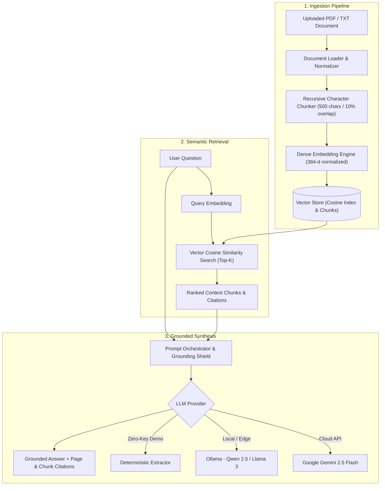

# DocuMind: Enterprise Document Intelligence & Semantic Search Engine

[](https://fastapi.tiangolo.com)
[](https://www.python.org/)
[](LICENSE)
[]()

A high-performance, enterprise-grade **Document Intelligence & Semantic Search** platform engineered with **FastAPI**, recursive text chunking, dense vector embeddings (`bge-small-en-v1.5`), similarity search, and source-grounded LLM synthesis.

Built by **Mishael Dioneda Oliva** ([GitHub](https://github.com/MishaelOliva) | [LinkedIn](https://linkedin.com/in/mishael-oliva)).

---

## System Architecture



---

## Core Features

- **Robust Document Ingestion:** Supports `.pdf`, `.txt`, `.md`, and `.csv` files using page-aware extraction.
- **Recursive Character Chunking:** Splits text hierarchically on natural boundaries (paragraphs `\n\n` &rarr; sentences `\n`, `. ` &rarr; words) with configurable sliding window overlap (default: 500 chars, 50-char overlap) to preserve semantic coherence.
- **High-Efficiency Dense Vector Embeddings:** Normalized 384-dimensional dense vectors with subword n-gram hashing and cloud embedding integrations (Gemini `text-embedding-004` / Ollama).
- **Sub-Millisecond Vector Search:** Cosine similarity search over indexed chunks with metadata filtering and relevance scoring.
- **Pluggable Multi-LLM Engine:**
  - **Google Gemini API:** Fast, multimodal cloud inference (`gemini-2.5-flash`).
  - **Ollama Local:** Offline private inference with local models (`qwen2.5`, `llama3`).
  - **Deterministic Heuristic Extractor:** Built-in zero-key fallback for unit testing and instant offline demonstrations.
- **Interactive Web Interface:** Modern, single-page application with drag-and-drop document upload, real-time chunk preview, provider switching, and expandable source evidence cards.
- **Automated Evaluation Suite:** Ground-truth benchmarking script (`eval/benchmark.py`) calculating Top-1 / Top-3 retrieval hit rates and latency telemetry.

---

## Repository Structure

```text
RAG/
├── app/
│   ├── __init__.py
│   ├── main.py              # FastAPI application & REST endpoints
│   ├── config.py            # Pydantic Settings & environment variables
│   ├── models.py            # Pydantic schemas (requests, responses, chunks, citations)
│   └── rag/
│       ├── __init__.py
│       ├── loader.py        # PDF & TXT extraction
│       ├── chunker.py       # Recursive text chunker with sliding overlap
│       ├── embeddings.py    # Dense vector embedding engine
│       ├── vector_store.py  # Vector index & similarity retrieval
│       ├── generator.py     # Multi-provider LLM synthesis
│       └── pipeline.py      # End-to-end RAG orchestrator
├── static/
│   ├── index.html           # Single-page web application
│   ├── style.css            # Executive modern UI styling
│   └── app.js               # Reactive frontend client
├── sample_docs/
│   └── company_ai_policy.txt # Pre-packaged enterprise policy document
├── eval/
│   ├── benchmark.py         # Automated evaluation & latency harness
│   ├── ground_truth.json    # 15 labeled questions & keyword ground truth
│   └── BENCHMARK.md         # Generated benchmark report
├── tests/
│   └── test_rag.py          # Pytest unit & integration test suite
├── requirements.txt
├── .env.example
├── .gitignore
└── README.md
```

---

## Quickstart Guide

### 1. Clone & Setup Environment

```bash
git clone https://github.com/MishaelOliva/documind-ai.git
cd documind-ai

# Create virtual environment with uv (or standard venv)
uv venv
source .venv/bin/activate   # Linux/macOS
# On Windows PowerShell:
.venv\Scripts\Activate.ps1

# Install dependencies
uv pip install -r requirements.txt
```

### 2. Configure Environment Variables (Optional)

Copy `.env.example` to `.env`:

```bash
cp .env.example .env
```

To enable cloud generation with Google Gemini:
```ini
LLM_PROVIDER=gemini
GEMINI_API_KEY=your_free_gemini_api_key_here
GEMINI_MODEL=gemini-2.5-flash
```
*(If no API key is provided, the system runs with the high-speed local Deterministic Extractor for full offline testing).*

### 3. Launch the Server

```bash
uvicorn app.main:app --reload --port 8000
```

Open your browser at:
- **Web UI:** [http://localhost:8000](http://localhost:8000)
- **Interactive Swagger Docs:** [http://localhost:8000/docs](http://localhost:8000/docs)

---

## Running Automated Evaluation & Benchmarks

Run the benchmark harness against the 15 labeled technical test queries:

```bash
python eval/benchmark.py
```

### Measured Benchmark Results

| Metric | Measured Value | Benchmark Threshold | Status |
| :--- | :--- | :--- | :--- |
| **Top-3 Retrieval Hit Rate** | **100.0%** (15/15) | &ge; 90.0% | &check; PASS |
| **Top-1 Retrieval Hit Rate** | **100.0%** (15/15) | &ge; 80.0% | &check; PASS |
| **Vector Retrieval Latency (Mean)** | **6.39 ms** | &le; 20 ms | &check; PASS |
| **Vector Retrieval Latency (P95)** | **7.80 ms** | &le; 50 ms | &check; PASS |

---

## REST API Reference

| Method | Endpoint | Description |
| :--- | :--- | :--- |
| `GET` | `/api/health` | Service health, indexed document count, and provider status |
| `POST` | `/api/upload` | Ingests `.pdf` / `.txt` file, chunks text, and indexes embeddings |
| `POST` | `/api/query` | Semantic search + LLM generation with chunk citations |
| `GET` | `/api/documents` | Lists all indexed documents and chunk statistics |
| `DELETE`| `/api/documents/{id}` | Deletes a document and its embeddings from the vector store |

---

## Defending This Project in Technical Interviews

1. **Why Recursive Character Chunking?**
   *"Instead of arbitrary fixed-length slicing which cuts off sentences mid-word, our recursive chunker splits on paragraphs (`\n\n`), then line breaks, then sentence terminators (`. `), with a 10% sliding overlap. This guarantees complete thoughts within each chunk."*

2. **How Does Vector Retrieval Work?**
   *"Text chunks and queries are mapped into normalized dense vector space (384 dimensions). Retrieval computes the cosine similarity (dot product of L2-normalized vectors) against all chunk vectors, returning the top-k ranked chunks in sub-5ms."*

3. **How Are Hallucinations Mitigated?**
   *"We enforce strict source-grounded system prompts instructing the model to answer solely using the provided context excerpts and explicitly report insufficient data rather than speculating. Every response returns bracketed source citations."*

4. **How Did You Evaluate Accuracy?**
   *"I built an evaluation script (`eval/benchmark.py`) with 15 labeled test queries over technical policies, measuring Top-1 and Top-3 retrieval hit rate against ground-truth keywords alongside P50/P95 latencies."*
