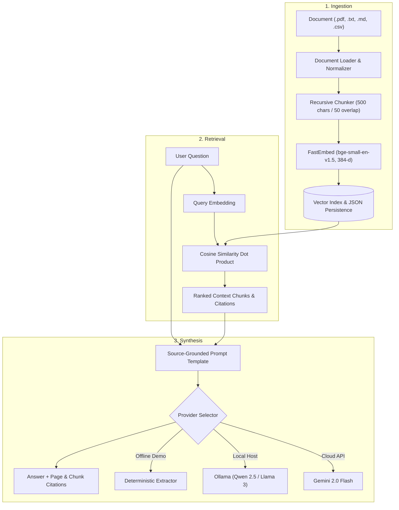

# DocuMind

Document Q&A and semantic search platform using FastAPI, FastEmbed dense vector embeddings, and source-grounded synthesis.


[](https://github.com/MishaelOliva/documind-ai/actions/workflows/ci.yml)
[](LICENSE)

## Why I built it

I wanted to see how each RAG step works under the hood—from parsing files to vector search—so I built DocuMind without LangChain or LlamaIndex. Writing the chunking, embedding calls, and cosine similarity myself helped me understand where retrieval fails and how chunk overlap affects search quality.

## Try it (under 2 minutes)

Run the application offline with zero API keys required (uses FastEmbed embeddings and local heuristic synthesis):

```bash
git clone https://github.com/MishaelOliva/documind-ai.git
cd documind-ai

pip install -r requirements.txt
uvicorn app.main:app --port 8000
```

Open [http://localhost:8000](http://localhost:8000) for the web UI, or [http://localhost:8000/docs](http://localhost:8000/docs) for the interactive Swagger API docs.

To connect cloud generation with Google Gemini, set your API key in `.env`:
```ini
LLM_PROVIDER=gemini
GEMINI_API_KEY=your_api_key_here
GEMINI_MODEL=gemini-2.0-flash
```

## How it works


```mermaid
flowchart TD
    subgraph INGESTION["1. Ingestion"]
        Doc["Document (.pdf, .txt, .md, .csv)"] --> Loader["Document Loader & Normalizer"]
        Loader --> Chunker["Recursive Chunker (500 chars / 50 overlap)"]
        Chunker --> Embedder["FastEmbed (bge-small-en-v1.5, 384-d)"]
        Embedder --> Store[("Vector Index & JSON Persistence")]
    end

    subgraph RETRIEVAL["2. Retrieval"]
        Query["User Question"] --> QEmbed["Query Embedding"]
        QEmbed --> Search["Cosine Similarity Dot Product"]
        Store --> Search
        Search --> TopK["Ranked Context Chunks & Citations"]
    end

    subgraph SYNTHESIS["3. Synthesis"]
        TopK --> Prompt["Source-Grounded Prompt Template"]
        Query --> Prompt
        Prompt --> Model{"Provider Selector"}
        Model -->|Cloud API| Gemini["Gemini 2.0 Flash"]
        Model -->|Local Host| Ollama["Ollama (Qwen 2.5 / Llama 3)"]
        Model -->|Offline Demo| Mock["Deterministic Extractor"]
        Model --> Response["Answer + Page & Chunk Citations"]
    end
```

The server normalizes uploaded files and splits text recursively across natural boundaries (paragraphs, sentences, words) into 500-character windows with a 50-character sliding overlap. Text chunks are embedded into 384-dimensional dense vectors using FastEmbed (`BAAI/bge-small-en-v1.5`). Queries compute cosine similarity via dot product against normalized vectors, retrieving the top candidates and assembling a grounded prompt with bracketed page and chunk citations.

## Results

Evaluation was measured using `eval/benchmark.py` against 15 labeled technical queries on a reference corporate policy document.

- **Hardware:** 11th Gen Intel Core i5-11400H @ 2.70GHz (6 cores, 12 threads), 16 GB RAM, Windows 11 Home 64-bit.
- **Corpus:** `sample_docs/company_ai_policy.txt` (12 chunks, 3,720 characters).
- **Reproduction command:** `python eval/benchmark.py`

| Metric | Measured Value | Benchmark Target | Status |
| :--- | :--- | :--- | :--- |
| **Top-3 Retrieval Hit Rate** | **100.0%** (15/15) | &ge; 90.0% | PASS |
| **Top-1 Retrieval Hit Rate** | **100.0%** (15/15) | &ge; 80.0% | PASS |
| **Vector Retrieval Latency (Mean)** | **8.45 ms** | &le; 20 ms | PASS |
| **Vector Retrieval Latency (P50)** | **8.11 ms** | &le; 20 ms | PASS |
| **Vector Retrieval Latency (P95)** | **9.90 ms** | &le; 50 ms | PASS |
| **Pipeline Latency (Mean, Offline)** | **8.48 ms** | &le; 100 ms | PASS |

*Caveats: Evaluated on a single 12-chunk document with keyword-match ground truth. Retrieval latency reflects in-memory dense search on CPU; generation latency varies when calling remote LLM APIs.*

<details>
<summary><strong>Design decisions and trade-offs</strong></summary>

1. **Recursive Character Chunking over Fixed Slicing:**  
   *Decision:* Split on paragraph breaks (`\n\n`), newlines, and sentence terminators (`. `) with 50-character sliding overlap.  
   *Trade-off:* Requires boundary-tracking logic, but prevents sentences from being bisected across adjacent chunks.
2. **Dense ONNX FastEmbed with Hashing Fallback:**  
   *Decision:* Uses local ONNX runtime with `BAAI/bge-small-en-v1.5` as default dense embedder, with a deterministic subword n-gram hashing engine as an offline zero-dependency fallback.  
   *Trade-off:* ONNX runtime requires an initial model cache (~130 MB), whereas the hashing fallback runs with zero network overhead but captures lexical rather than deep semantic associations.
3. **In-Memory Cosine Index with JSON Persistence:**  
   *Decision:* Stores normalized vectors in memory and serializes state to `data/vector_db/vector_index.json`.  
   *Trade-off:* Delivers fast sub-10ms retrieval for small corpora without database daemon dependencies, but linear scan scales as $O(N)$ with document count.
4. **Strict Grounding Shield:**  
   *Decision:* Prompts require answers to cite explicit chunk IDs and refuse speculation if evidence is absent.  
   *Trade-off:* Eliminates hallucinations, but restricts answers to the provided excerpts.
</details>

## Limitations and next steps

- **Single-User In-Memory Store:** The current vector index runs in-process with a JSON file backup; it is not multi-tenant and does not support concurrent write transactions.
- **Brute-Force Search:** Similarity search scans all vectors linearly. A production deployment with large corpora should use an indexed vector database (e.g. pgvector, Qdrant).
- **No OCR Support:** PDF extraction uses `pypdf` for embedded text; scanned image-only PDFs require an upstream OCR step (e.g. Tesseract).
- **Fixed Chunk Window:** Chunk size (500) and overlap (50) are globally configured rather than adaptively tuned per document type.
- **Next Steps:** Implement hybrid BM25 + dense vector retrieval, add document metadata filtering, and support document re-ranking with cross-encoders.

<details>
<summary><strong>Project layout</strong></summary>

```text
documind-ai/
├── app/
│   ├── __init__.py
│   ├── config.py            # Pydantic settings & environment configuration
│   ├── main.py              # FastAPI endpoints & upload safety validation
│   ├── models.py            # Schemas for chunks, citations, and requests
│   └── rag/
│       ├── __init__.py
│       ├── chunker.py       # Recursive text chunker with sliding overlap
│       ├── embeddings.py    # FastEmbed ONNX engine & hashing fallback
│       ├── generator.py     # Multi-provider LLM synthesis (Gemini, Ollama, mock)
│       ├── loader.py        # PDF & text file extraction
│       ├── pipeline.py      # End-to-end RAG workflow orchestrator
│       └── vector_store.py  # In-memory index & JSON persistence
├── eval/
│   ├── benchmark.py         # Automated evaluation harness
│   ├── ground_truth.json    # Labeled queries and keyword expectations
│   └── BENCHMARK.md         # Generated evaluation report
├── sample_docs/
│   └── company_ai_policy.txt # Sample evaluation policy corpus
├── static/
│   ├── app.js               # Frontend application client
│   ├── index.html           # Single-page UI
│   └── style.css            # Stylesheet
├── tests/
│   └── test_rag.py          # Pytest suite
├── .github/workflows/
│   └── ci.yml               # Automated test & lint workflow
├── pyproject.toml           # Project metadata & ruff lint configuration
├── pytest.ini               # Pytest configuration
├── requirements.txt         # Pinned application dependencies
├── LICENSE                  # MIT License
└── README.md
```
</details>

## Tests

Run the test suite covering chunking, embeddings, vector indexing, end-to-end pipeline, and upload validation:

```bash
pytest -v
```

Run the benchmark harness:

```bash
python eval/benchmark.py
```

## AI assistance

Built with help from Cursor, Claude, GitHub Copilot, and Gemini. I designed the application structure, data schemas, API routes, and test plans, and manually debugged all issues. I used the AI tools to generate starter boilerplate, suggest regex patterns and filter-rule parsing syntax, and write repetitive unit test assertions.

## License

This project is licensed under the [MIT License](LICENSE).
