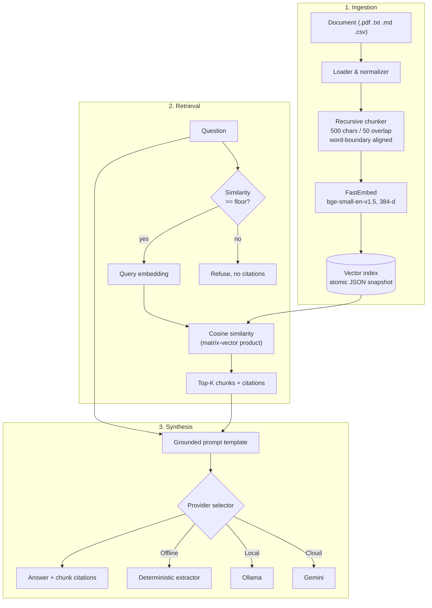

# DocuMind

Document question answering over dense vector retrieval and source-grounded synthesis.


[](https://github.com/MishaelOliva/documind-ai/actions/workflows/ci.yml)
[](LICENSE)

## Why I built it

Most RAG repositories are a thin wrapper around a framework. I wanted to know what
each stage actually does, so this is built without LangChain or LlamaIndex. The text
splitter, the embedding calls, the cosine search, the citation format and the
pluggable LLM dispatch are all in this repository and readable end to end. Writing
them by hand is also what surfaced the finding in [Grounding](#the-grounding-guard-and-its-real-limit)
below, which I would not have found by calling a library.

## Try it in under two minutes

Runs fully offline. No API key, no database, no build step.

```bash
git clone https://github.com/MishaelOliva/documind-ai.git
cd documind-ai

pip install -r requirements.txt
uvicorn app.main:app --reload
```

Open <http://localhost:8000> for the web UI, or `/docs` for the OpenAPI reference.

The first run downloads a ~130 MB ONNX model for `BAAI/bge-small-en-v1.5`. If that
fails, the app degrades to a dependency-free hashing embedder and keeps working, so
you can still run everything below.

To use a hosted model instead, set `LLM_PROVIDER=gemini` and `GEMINI_API_KEY` in
`.env` (see `.env.example`). Requests fall back to the offline extractor if the
remote call fails, and the response reports the provider that *actually* produced
the answer.

## How it works


```mermaid
flowchart TD
    subgraph INGESTION["1. Ingestion"]
        Doc["Document (.pdf .txt .md .csv)"] --> Loader["Loader & normalizer"]
        Loader --> Chunker["Recursive chunker<br/>500 chars / 50 overlap<br/>word-boundary aligned"]
        Chunker --> Embedder["FastEmbed<br/>bge-small-en-v1.5, 384-d"]
        Embedder --> Store[("Vector index<br/>atomic JSON snapshot")]
    end

    subgraph RETRIEVAL["2. Retrieval"]
        Q["Question"] --> Floor{"Similarity<br/>>= floor?"}
        Floor -->|no| Refuse["Refuse, no citations"]
        Floor -->|yes| QEmbed["Query embedding"]
        QEmbed --> Search["Cosine similarity<br/>(matrix-vector product)"]
        Store --> Search
        Search --> TopK["Top-K chunks + citations"]
    end

    subgraph SYNTHESIS["3. Synthesis"]
        TopK --> Prompt["Grounded prompt template"]
        Q --> Prompt
        Prompt --> Model{"Provider selector"}
        Model -->|Cloud| Gemini["Gemini"]
        Model -->|Local| Ollama["Ollama"]
        Model -->|Offline| Mock["Deterministic extractor"]
        Model --> Response["Answer + chunk citations"]
    end
```

## Results

Measured by `python eval/benchmark.py` on 15 labeled questions over
`sample_docs/company_ai_policy.txt` (12 chunks, 3,720 characters).

- **Hardware:** 11th Gen Intel Core i5-11400H @ 2.70 GHz, 16 GB RAM, Windows 11.
- **Embedder:** `BAAI/bge-small-en-v1.5` via ONNX Runtime (CPU).

### Retrieval accuracy

| Metric | Result | Random baseline | Notes |
| :--- | :--- | :--- | :--- |
| **Passage-level top-1** | **100.0%** (15/15) | 0.0% | Scored on the `section` label |
| **Passage-level top-3** | **100.0%** (15/15) | 40.0–53.3% | Scored on the `section` label |

Scoring uses the `section` field in `eval/ground_truth.json`: the retrieved chunk
counts as a hit only if it actually overlaps the subsection the question is about.
A keyword match anywhere in a chunk is too loose to be useful — dropping a single
gold keyword from every query still leaves all 15 "matchable".

**Top-1 is the number that matters.** At top-3 the 12-chunk corpus is close to
saturated by chance, so a high top-3 score on its own carries little information. The
baseline column exists because a hit rate without a control is not interpretable.

### Latency

| Stage | Mean | P95 |
| :--- | :--- | :--- |
| Query embedding (ONNX transformer) | ~6–9 ms | ~7–11 ms |
| Vector search (matrix-vector product) | ~0.1–0.3 ms | ~1 ms |
| End-to-end, offline extractor | ~7–10 ms | - |

Embedding dominates search by roughly two orders of magnitude, so the API reports
`embedding_latency_ms` and `search_latency_ms` separately. Reporting only their sum
as "retrieval latency" overstates the cost of the search by ~50x, and would make the
in-memory index look far more expensive than it is.

The end-to-end row uses the deterministic offline extractor. A hosted LLM adds
0.5–5 s of network and generation time; that is not a retrieval cost and is not
included.

<a id="the-grounding-guard-and-its-real-limit"></a>
### The grounding guard, and its real limit

The sample policy's own Section 4.2 requires declining when the top-1 cosine
similarity falls below **0.35**. That is implemented, and the corpus exists partly so
the requirement is testable.

It is also not sufficient, which is worth stating plainly:

| | Mean top-1 similarity |
| :--- | :--- |
| In-domain questions | 0.78 |
| Off-topic questions | 0.47 |

Because the two distributions overlap, **off-topic refusal rate at the 0.35 floor is
0%** — the benchmark's five deliberately unrelated questions ("Who won the 1998 FIFA
World Cup final?") are all answered, at similarities as high as 0.55. `bge-small`
simply does not push unrelated text below 0.35 when the whole corpus is one narrow
domain.

So the guard is necessary but not sufficient, and the honest fix is one of:

- **Calibrate the floor from a labelled negative set.** The two means above are
  ~0.31 apart, so a threshold near 0.62 would separate this corpus. That number is
  corpus-specific and must not be carried over blindly.
- **Score-distribution rejection** (z-score or margin between top-1 and top-k)
  instead of an absolute floor, so the threshold adapts to the corpus.
- **Cross-encoder re-ranking** on the top-k candidates, which is the standard fix
  and the main item in Next Steps.

The floor stays at the policy-mandated 0.35 by default rather than being tuned to
make a demo look good. `MIN_SIMILARITY_SCORE` is configurable.

## Design decisions

1. **No RAG framework.** Chunking, embeddings, search, and provider dispatch are
   implemented directly. *Trade-off:* more code to own and test, in exchange for
   every stage being inspectable and tunable.
2. **Recursive chunking with word-boundary alignment.** Splits on paragraph breaks,
   newlines, sentence terminators, then words. The hard-split path snaps every
   boundary onto whitespace, because the naive version cut mid-word and produced
   chunks starting `"ust never be exposed"`. *Trade-off:* slightly more logic; the
   alternative feeds truncated tokens into the embedding space.
3. **ONNX embeddings with a hashing fallback.** `bge-small-en-v1.5` locally, or a
   deterministic subword n-gram hashing embedder with no network access.
   *Trade-off:* ~130 MB one-time model cache, versus a fallback that captures lexical
   similarity only and should not be mistaken for semantic retrieval.
4. **In-memory index with an atomic JSON snapshot.** Vectors stay in RAM and are
   serialized to disk via write-temp-then-`os.replace`. A corrupt index is moved
   aside rather than silently discarded, so a crash cannot masquerade as an empty
   database. *Trade-off:* linear scan is O(N); fine to ~10⁵ chunks, not beyond.
5. **Refuse rather than answer.** Below the similarity floor the pipeline returns an
   explicit refusal with no citations, instead of passing a weak chunk to a generator
   that would be primed to produce something. *Trade-off:* occasionally refuses a
   question it could have answered, which is the intended bias.

## Limitations

- **Single-process, in-memory index.** No multi-tenancy, no concurrent write
  transactions. A lock serialises mutations within one process; multiple workers
  would each hold their own copy.
- **Brute-force search.** Every query is a full matrix-vector product. Fine at this
  scale; a real deployment wants pgvector, Qdrant, or an ANN index.
- **The similarity floor does not reject off-topic questions** on a narrow corpus.
   Quantified above, with the remedies.
- **No OCR.** `pypdf` reads the embedded text layer; scanned, image-only PDFs fail
   with a clear error instead of being indexed as empty.
- **Fixed chunk window.** 500/50 is global rather than tuned per document type, and
  is denominated in characters, not tokens — so token counts vary with content.
- **No auth, rate limiting, or quotas.** Single-user local tool.

**Next steps:** hybrid BM25 + dense retrieval with reciprocal rank fusion,
cross-encoder re-ranking, token-accurate chunking, and an ANN index.

## Testing

```bash
pip install -r requirements-dev.txt
pytest -v                    # 33 tests
ruff check .
python eval/benchmark.py     # retrieval and grounding evaluation
```

CI runs lint, the test suite with coverage, and the benchmark across Python 3.11/3.12
on Linux and Windows.

The suite covers the paths that actually break: chunk-boundary alignment, vector
index persistence and corruption recovery, provider-fallback reporting, the
grounding guard, upload limits and error codes, and filename sanitisation.

## Project layout

```text
documind-ai/
├── app/
│   ├── config.py            # Settings, similarity floor, CORS, extension allow-list
│   ├── main.py              # FastAPI routes, upload validation, filename sanitisation
│   ├── models.py            # Pydantic request/response schemas
│   └── rag/
│       ├── chunker.py       # Recursive splitter, word-boundary aligned
│       ├── embeddings.py    # FastEmbed / Gemini / Ollama / hashing
│       ├── generator.py     # Provider dispatch with reported fallback
│       ├── loader.py        # PDF and text extraction
│       ├── pipeline.py      # Orchestration, grounding guard, latency split
│       └── vector_store.py  # In-memory index, atomic persistence, cosine search
├── eval/
│   ├── benchmark.py         # Retrieval, baseline, latency, off-topic evaluation
│   └── ground_truth.json    # Labeled questions with expected keywords and sections
├── static/                  # Dependency-free SPA (no build step)
├── tests/test_rag.py
└── docs/screenshots/
```

## API

| Method | Path | Purpose |
| :--- | :--- | :--- |
| `GET` | `/api/health` | Status, index stats, active embedder, similarity floor |
| `POST` | `/api/upload` | Ingest a document (multipart) |
| `POST` | `/api/query` | Retrieve and answer, with citations and latency telemetry |
| `GET` | `/api/documents` | List indexed documents |
| `DELETE` | `/api/documents/{doc_id}` | Remove a document and its vectors |

## AI assistance

Built with assistance from Cursor, Claude, GitHub Copilot, and Gemini. I designed the
application structure, data schemas, API routes, and test plan, and worked through the
bugs. The tools were used for boilerplate, regex patterns, and repetitive test
assertions. The findings in the Results section — the latency attribution, the
baseline, and the similarity-floor analysis — came from measuring the running system
rather than from the assistants.

## License

[MIT](LICENSE)

---
*Built by [Mishael Oliva](https://github.com/MishaelOliva) • [LinkedIn](https://www.linkedin.com/in/mishael-oliva-96a31b3a2)*
